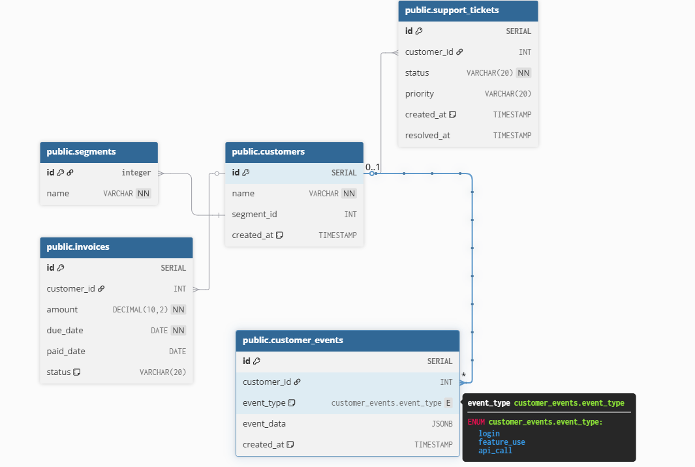

# Architecture Overview
## System Components

### The Customer Health Dashboard consists of three main components:

### 1. Frontend (React + TypeScript)

- Provides a dashboard and customer views.
- Fetches health data and events via REST API calls.
- Displays charts and tables for quick insights.

### 2. Backend (Node.js + Express)
  
- Exposes REST API endpoints:
  - `GET /api/customers` → list customers with scores
  - `GET /api/customers/{id}/health` → detailed health breakdown
  - `POST /api/customers/{id}/events` → record activity
  - `GET /api/dashboard` → summary stats for frontend

- Calculates health scores dynamically using these factors:
  - Login frequency
  - Feature adoption
  - Ticket volume
  - Invoice timeliness
  - API usage

### 3. Database (PostgreSQL)

- Stores customers, invoices, support tickets, and events.
- Initialized with init.sql (50+ sample customers, 3+ months of events).

## Main Flows
1. Showing the dashboard:
   1. User opens main page, index.html is loaded
   2. Frontend checks if the data is in the redux store cache. 
   If so UI is rendered and return the data
   3. If the data is not in cache, backend api for `/dashboard` is called
   4. Backend - gets data from database: customers list, customer data
   5. Backend calculates health scores for all customers and finds the top 5 "at risk" customers
   6. Backend returns data to the frontend
   7. Frontend caches the data in redux store, and renders the UI (dashboard page)
   
2. Showing the customers list:
   1.  User press the all customers button
   2.  Frontend checks if the data is in the redux store cache. 
   If so UI is rendered and return the data
   3.  If the data is not in cache, backend api for `/customers` is called
   4.  Backend - gets data from database: customers list, customer data
   5.  Backend calculates health scores for all customers
   6.  Backend returns data to the frontend
   7.  Frontend caches the data in redux store, and renders the UI (dashboard page)

3. Showing the customer details:
   1.  User press on a customer
   2.  Frontend checks if the data is in the redux store cache. 
   If so UI is rendered and return the data
   3.  If the data is not in cache, backend api for `/customers/:id/health` is called
   4.  Backend - gets data from database: customer details with the description of all the events, support tickets and Invoice payment timeliness
   5.  Backend calculates health scores for the customer
   6.  Backend returns data to the frontend
   7.  Frontend caches the data in redux store, and renders the UI (dashboard page)

4. Update event:
   1.  User calls backend api for `/customers/:id/events` to update event, with required event type and data
   2.  Backend - validate the data is done by the backend.
   3.  Data is inserted into database - it returns status if everything was saved correctly
  
## Deployment & Infrastructure

- Containerized with Docker Compose
  - `frontend` → React app
  - `backend` → Express API
  - `db` → PostgreSQL
- Services communicate via a private Docker network.
- Frontend connects to backend at `http://<backend.url>:8000/api`.
- Backend connects to database at `db:5432`.

## Database Diagram

## Key Design Choices

- **Separation of Concerns:** Clear split between API, UI, and DB.
- **Scalability:** Containers allow horizontal scaling (e.g., multiple backend instances).
- **Extensibility:** New health factors can be added by extending calculation logic.
- **Reliability:** Automated tests ensure calculation accuracy (97% coverage).