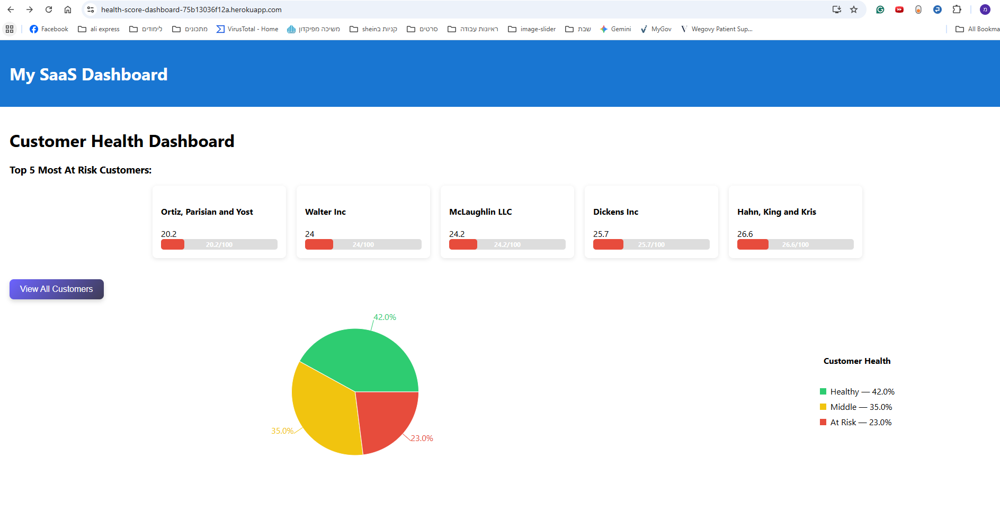
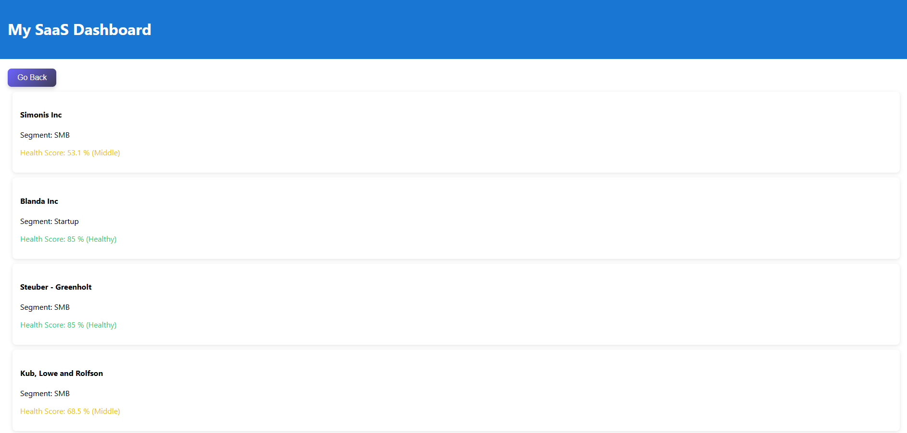
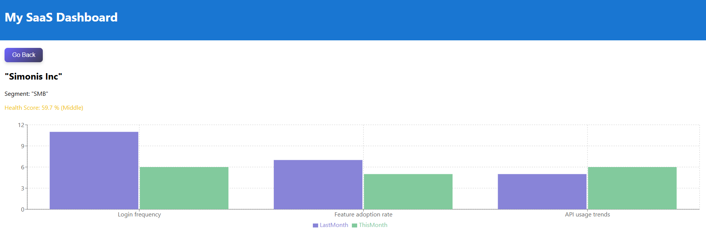
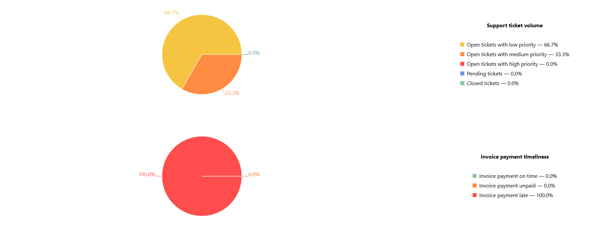
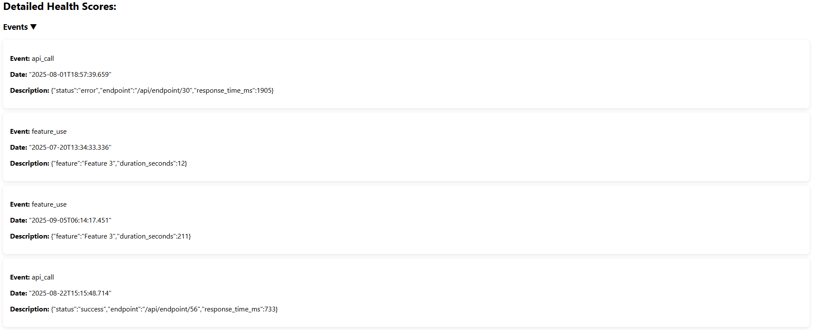
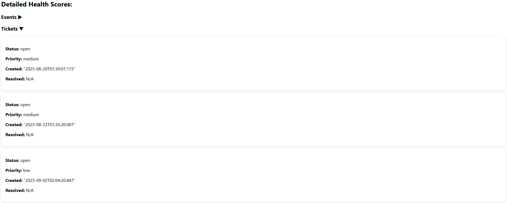
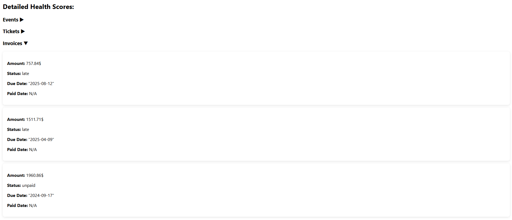

# Deployment Documentation
## Live URL
https://health-score-dashboard-75b13036f12a.herokuapp.com/

## Note 
**In the development environment, the React app is running on a different url then the Backend. In the production environment, the URL of the React app is the same as the backend (api). The React relative path is:`/` where the api's relative path is `/api/`**
   
## Prerequisites

- Clone the repo from https://github.com/moriagr/customer-health-dashboard.git.
- [Docker](https://docs.docker.com/get-docker/) installed
- [Heroku CLI](https://devcenter.heroku.com/articles/heroku-cli) installed
- A Heroku account
- Project structure:
  ```bash
  project-root/
  |- backend/
  |- frontend/
  |- Dockerfile
  |- docker-compose.yml
  |- db
  ```

---

## Heroku Setup

### Step 1: Prepare React Frontend
1. Go to the frontend folder:
```bash
cd frontend 
```
2. Build React for production:
```bash
npm install
npm run build
```
3. This creates a `build/` folder inside frontend/

### Step 2: Prepare PostgreSQL for Heroku 
Create a PostgreSQL DB in Supabase and get the DB url and password

### step 3: Set Environment Variables for production
Set the following Heroku config vars:
```.env
heroku config:set 
  DATABASE_URL=<your-db-url> \
  NODE_ENV=production \
  FRONTEND_URL=<your-frontend-url> \
  REACT_APP_API_URL=http://<your-backend-url>

```


### step 4: Deploy using Heroku CLI
1. If you haven't already, log into your Heroku account and follow the prompts to create a new SSH public key
```bash
heroku login
```
2. **Log in to Container Registry:**
You must have Docker set up locally to continue. You should see output when you run this command.
```bash
docker ps
```
Now you can sign into Container Registry

```bash
heroku container:login
```
3. **Push your Docker-based app:**
Build the Dockerfile in the current directory and push the Docker image

```bash
    heroku container:push web
```

4. **Deploy the changes:**
Release the newly pushed images to deploy your app

```bash
    heroku container:release web
```


### Step 7: Open Your App

```bash
heroku open
```
Your live URL will look like: https://health-score-dashboard.herokuapp.com/

React frontend loads.

API routes like `/api/customers` work on the same domain.


## Running Application Screenshots
### Dashboard
Dashboard overview

### All customers list
All customers' list

### Customer details
Comparison api, login and feature use between last month and this month

Support ticket volume and Invoice payment timeliness

Collapsed data list

Events (api, feature use, login) data history

Support tickets' data history

Invoice payment timeliness history

