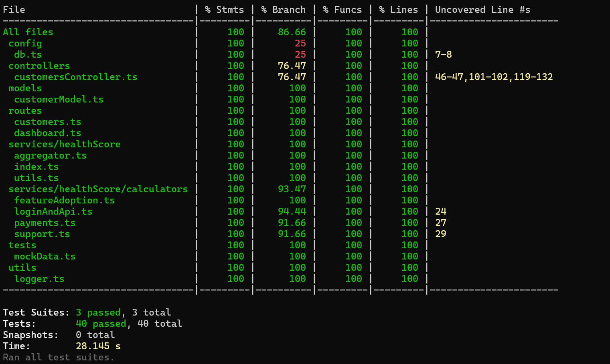

# Customer Health Dashboard
### Created by Moria Grohar, 9/2025, moriagro@gmail.com
A full-stack application for monitoring **customer health scores** based on invoices, tickets, and product usage events.  
The system provides insights into customer segments, health score trends, and potential risks.  

---

## Public URL
https://health-score-dashboard-75b13036f12a.herokuapp.com/

## Features
- Dashboard containing top 5 At-risk customers, list to customers list and graphical customers health distribution
- Customer list with health scores
- Detailed customer view (events, invoices, tickets)
- Real-time health score calculation
- Error handling with clear messages
- Designed UI components (CustomButton, ErrorBox, ProgressBar, Loading)
- Automated testing including Unit tests, Integration tests. Code coverage of **97%** 

---

## Tech Stack
### Frontend
- React + TypeScript
- CSS Modules for styling

### Backend
- Node.js + Express
- PostgreSQL (with init.sql for schema)

### Infrastructure
- Docker & Docker Compose
- ESLint + Prettier for code quality
- Jest + backend Testing Library for tests

---

## Setup Instructions

### 1. Clone Repository
```bash
git clone https://github.com/moriagr/customer-health-dashboard.git
cd customer-health-dashboard
```

### 2. Environment Variables

Create `.env` files for backend and frontend in the main library. 
Example for backend:
`\backend\.env`
```ini
    DB_USER=postgres
    DB_PASS=postgres
    DB_HOST=db
    DB_PORT=5432
    DB_NAME=customer_health
    PORT=8000
```
Example for frontend:
`\frontend\.env`

```ini
    REACT_APP_API_URL=http://localhost:8000/api

```
---
## Run with Docker

Make sure you have Docker & Docker Compose installed https://docs.docker.com/engine/install/

```bash
docker-compose up --build
```

This will start:

- Postgres DB at localhost:5432
- Backend at http://localhost:8000/api
- Frontend at http://localhost:8000/
---
## Run without Docker

### 1. Database

Make sure PostgreSQL is running locally and matches your `.env` credentials. Run `db/init.sql` to set up schema.

### 2. Backend
```bash
cd backend
npm install
npm run dev
```

Backend will run on: http://localhost:8000/api

### 3. Frontend
```bash
cd frontend
npm install
npm start
```

Frontend will run on: http://localhost:/8000

---
## Running Tests

### Frontend
```bash
cd frontend
npm test
```

### Backend
```bash
cd backend
npm test
```

**Tests include:**

* **Unit tests:** Health score calculation logic 

* **Integration tests:** API endpoints

* **Code Coverage:** 87%


---
## AI Collaboration Evidence

This project was developed with the support of AI tools, which assisted in:

Designing reusable UI components (Loading, ErrorBox, ProgressBar, CustomButton)

Refactoring inline styles into CSS Modules

Researching best practices for Express routing and CORS handling

Refining health score calculation functions and backend structure

See [AI Documentation](./documentation/AI_README.md) for more details.

---
## API Documentation

The backend provides a RESTful API for managing customers, events, support tickets, and invoices, as well as fetching summarized health data for dashboards. It includes endpoints to list customers, get detailed customer health scores, add events or tickets, and retrieve dashboard statistics. Each endpoint provides clear success, error, and validation responses. 

See [API Documentation](./documentation/API_README.md) for more details.

---
## Research Documentation

The research documents the methodology behind the customer health score calculation, including metric definitions, weighting, and scoring rationale.  
See [Research Documentation](./documentation/Research_README.md) for more details.

---
## Architecture Overview

A full-stack app with React frontend, Node.js backend, and PostgreSQL. Calculates customer health scores from events, tickets, and invoices. Containerized with Docker Compose for easy deployment. 
See [Architecture Overview](./documentation/Architecture_Overview_README.md) for more details.

---
## Deployment Overview

Explanation on how to run the deployments, and application screenshots 
See [Deployment Overview](./documentation/Deployment_README.md) for more details.